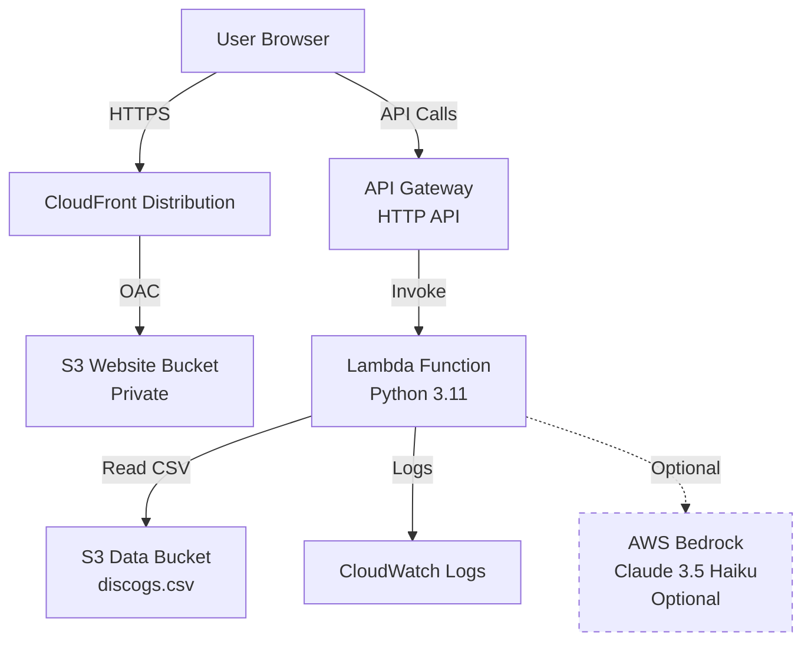
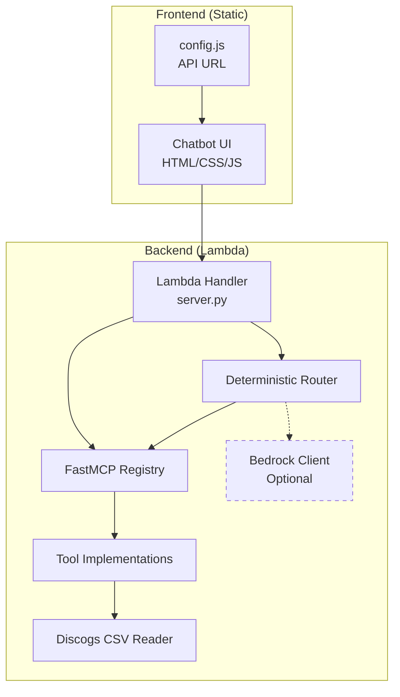

# Design Document: Vinyl Collection Chatbot

## Overview

The Vinyl Collection Chatbot is a production-ready serverless application demonstrating Model Context Protocol (MCP) and FastMCP integration on AWS. The system provides a natural language interface for querying a Discogs vinyl collection through a web-based chatbot UI.

The architecture follows AWS serverless best practices with:
- Static web hosting via S3 + CloudFront
- API Gateway + Lambda for backend processing
- FastMCP for MCP-compliant tool definitions and execution
- Deterministic routing with optional Bedrock enhancement
- Infrastructure-as-code using Terraform

## Architecture

### High-Level Architecture



### Component Architecture



### Request Flow

**Deterministic Mode:**
1. User sends message via Chatbot UI
2. API Gateway routes POST /chat to Lambda
3. Lambda handler receives request
4. Deterministic Router analyzes message for intent
5. Router selects tool and infers parameters
6. FastMCP validates parameters against schema
7. Tool executes and returns results
8. Handler formats response with tool metadata
9. Response returned to UI

**Bedrock Mode (Optional):**
1. User sends message via Chatbot UI
2. API Gateway routes POST /chat to Lambda
3. Lambda handler receives request
4. Bedrock invoked with message + tool schemas
5. Bedrock selects tool and generates parameters
6. FastMCP validates parameters against schema
7. Tool executes and returns results
8. Bedrock invoked again to draft conversational response
9. Handler formats response with tool metadata
10. Response returned to UI

## Components and Interfaces

### Frontend Components

#### Chatbot UI (index.html, app.js, styles.css)

**Responsibilities:**
- Render chat transcript with user and bot messages
- Provide input field and send button
- Display tool usage indicators
- Show expandable tool results
- Handle loading and error states
- Provide clickable example queries

**Interface:**
```javascript
// Configuration
window.__CONFIG__ = {
  API_BASE_URL: "https://api.example.com"
}

// API Client
async function sendMessage(message, sessionId, mode) {
  // POST ${API_BASE_URL}/chat
  // Returns: { answer, toolUsed, toolName, toolArgs, toolResults, requestId, model }
}

async function getTools() {
  // GET ${API_BASE_URL}/tools
  // Returns: [{ name, description, inputSchema }]
}

async function checkHealth() {
  // GET ${API_BASE_URL}/health
  // Returns: { status: "healthy" }
}
```

**Example Queries:**
- "What records do I have by Grimes?"
- "Do I have anything on 4AD?"
- "Show me records from 2016"
- "Give me a quick stats summary"
- "List some artists"

### Backend Components

#### Lambda Handler (server.py)

**Responsibilities:**
- Route incoming API Gateway events
- Initialize FastMCP registry
- Coordinate between router and tools
- Format responses
- Handle errors gracefully

**Interface:**
```python
def lambda_handler(event: dict, context: Any) -> dict:
    """
    Main Lambda entry point.
    
    Routes:
    - POST /chat: Process chat message
    - GET /tools: Return tool definitions
    - GET /health: Health check
    
    Returns API Gateway response format.
    """
    pass

def handle_chat(body: dict) -> dict:
    """
    Process chat request.
    
    Args:
        body: { message: str, sessionId?: str, mode?: str }
    
    Returns:
        {
            answer: str,
            toolUsed: bool,
            toolName: str | None,
            toolArgs: dict | None,
            toolResults: list[str] | None,
            requestId: str,
            model: str | None
        }
    """
    pass

def handle_tools() -> list[dict]:
    """
    Return FastMCP tool definitions.
    
    Returns:
        [{ name: str, description: str, inputSchema: dict }]
    """
    pass

def handle_health() -> dict:
    """
    Health check endpoint.
    
    Returns:
        { status: str, timestamp: str }
    """
    pass
```

#### FastMCP Registry

**Responsibilities:**
- Register tools with decorators
- Generate JSON schemas from type hints
- Validate tool parameters
- Execute tools through registry
- Provide tool metadata

**Interface:**
```python
from fastmcp import FastMCP

mcp = FastMCP("vinyl-collection-chatbot")

@mcp.tool()
def query_vinyl_collection(
    query_type: Literal["artist", "title", "label", "year", "all"],
    search_term: str,
    limit: int = 10
) -> list[str]:
    """
    Query the vinyl collection by various criteria.
    
    Args:
        query_type: Type of query to perform
        search_term: Search term to match
        limit: Maximum results (1-50)
    
    Returns:
        List of formatted record strings
    """
    pass

# Access tool schemas
tools = mcp.list_tools()  # Returns tool metadata
result = mcp.call_tool("query_vinyl_collection", {...})  # Execute tool
```

#### Deterministic Router (vinyl/router.py)

**Responsibilities:**
- Parse user messages for intent
- Extract parameters using pattern matching
- Select appropriate tool
- Generate fallback responses
- No external API calls

**Interface:**
```python
class DeterministicRouter:
    """Rules-based router for tool selection."""
    
    def route(self, message: str) -> RouterResult:
        """
        Analyze message and determine tool + parameters.
        
        Args:
            message: User's natural language message
        
        Returns:
            RouterResult with tool_name, tool_args, or fallback_response
        """
        pass
    
    def _detect_intent(self, message: str) -> Intent:
        """Detect user intent from message."""
        pass
    
    def _extract_params(self, message: str, intent: Intent) -> dict:
        """Extract parameters for the detected intent."""
        pass

@dataclass
class RouterResult:
    tool_name: str | None
    tool_args: dict | None
    fallback_response: str | None
    confidence: float
```

**Intent Detection Patterns:**
- Artist query: "what do I have by {artist}", "records by {artist}", "show me {artist}"
- Label query: "anything on {label}", "records on {label}", "{label} releases"
- Year query: "records from {year}", "{year} releases", "stuff from {year}"
- Year range: "between {year} and {year}", "from {year} to {year}"
- Stats: "how many", "stats", "summary", "collection stats"
- List artists: "list artists", "show artists", "what artists"
- General search: "search {term}", "find {term}"

#### Bedrock Client (Optional)

**Responsibilities:**
- Invoke Bedrock Claude 3.5 Haiku
- Format tool schemas for Bedrock
- Parse Bedrock tool selection
- Generate conversational responses
- Handle Bedrock errors

**Interface:**
```python
class BedrockClient:
    """Optional Bedrock integration for enhanced responses."""
    
    def __init__(self, model_id: str, region: str):
        self.model_id = model_id
        self.region = region
        self.client = boto3.client('bedrock-runtime', region_name=region)
    
    def select_tool(self, message: str, tools: list[dict]) -> ToolSelection:
        """
        Use Bedrock to select tool and generate parameters.
        
        Args:
            message: User message
            tools: Available tool schemas from FastMCP
        
        Returns:
            ToolSelection with tool_name and tool_args
        """
        pass
    
    def generate_response(
        self,
        message: str,
        tool_name: str,
        tool_results: list[str]
    ) -> str:
        """
        Generate conversational response grounded in tool results.
        
        Args:
            message: Original user message
            tool_name: Tool that was executed
            tool_results: Results from tool execution
        
        Returns:
            Natural language response
        """
        pass

@dataclass
class ToolSelection:
    tool_name: str
    tool_args: dict
    confidence: float
```

#### Discogs CSV Reader (vinyl/discogs.py)

**Responsibilities:**
- Download CSV from S3
- Cache CSV in memory during invocation
- Parse CSV with csv.DictReader
- Normalize field values
- Handle missing columns gracefully
- Provide query interface

**Interface:**
```python
class DiscogsCollection:
    """Manages Discogs CSV data."""
    
    def __init__(self, bucket: str, key: str):
        self.bucket = bucket
        self.key = key
        self._records: list[dict] | None = None
    
    def load(self) -> None:
        """Download and parse CSV from S3."""
        pass
    
    def query(
        self,
        query_type: str,
        search_term: str,
        limit: int = 10
    ) -> list[dict]:
        """
        Query records by type and term.
        
        Args:
            query_type: One of artist, title, label, year, all
            search_term: Term to search for
            limit: Maximum results
        
        Returns:
            List of matching record dicts
        """
        pass
    
    def filter_records(
        self,
        artist: str | None = None,
        label: str | None = None,
        year_from: int | None = None,
        year_to: int | None = None,
        limit: int = 10
    ) -> list[dict]:
        """Filter records by multiple criteria."""
        pass
    
    def get_artists(
        self,
        starts_with: str | None = None,
        limit: int = 25
    ) -> list[str]:
        """Get unique artist names."""
        pass
    
    def get_stats(self) -> dict:
        """Calculate collection statistics."""
        pass
    
    def _normalize(self, value: str) -> str:
        """Normalize string for comparison."""
        return value.strip().lower()
    
    def _parse_year(self, released: str) -> int | None:
        """Extract year from Released field."""
        pass
    
    def _format_record(self, record: dict) -> str:
        """Format record as display string."""
        return f"{record['Artist']} - {record['Title']} ({record['Label']}, {record['Released']})"
```

### Tool Implementations

#### query_vinyl_collection

```python
@mcp.tool()
def query_vinyl_collection(
    query_type: Literal["artist", "title", "label", "year", "all"],
    search_term: str,
    limit: int = 10
) -> list[str]:
    """
    Query the vinyl collection by various criteria.
    
    Searches the collection for records matching the specified criteria.
    Case-insensitive matching is used for all text searches.
    
    Args:
        query_type: Type of query - artist, title, label, year, or all
        search_term: The term to search for
        limit: Maximum number of results to return (1-50, default 10)
    
    Returns:
        List of formatted record strings: "Artist - Title (Label, Year)"
    
    Examples:
        query_vinyl_collection("artist", "Grimes", 5)
        query_vinyl_collection("label", "4AD", 10)
        query_vinyl_collection("year", "2016", 20)
    """
    # Validate limit bounds
    limit = max(1, min(50, limit))
    
    # Query collection
    collection = get_collection()
    records = collection.query(query_type, search_term, limit)
    
    # Format results
    return [collection._format_record(r) for r in records]
```

#### list_artists

```python
@mcp.tool()
def list_artists(
    starts_with: str | None = None,
    limit: int = 25
) -> list[str]:
    """
    List unique artists in the collection.
    
    Returns a sorted list of unique artist names. Optionally filter
    to artists starting with a specific string.
    
    Args:
        starts_with: Optional prefix to filter artists (case-insensitive)
        limit: Maximum number of artists to return (1-100, default 25)
    
    Returns:
        Sorted list of unique artist names
    
    Examples:
        list_artists()  # All artists
        list_artists("G", 10)  # Artists starting with G
    """
    # Validate limit bounds
    limit = max(1, min(100, limit))
    
    # Get artists
    collection = get_collection()
    artists = collection.get_artists(starts_with, limit)
    
    return artists
```

#### stats_summary

```python
@mcp.tool()
def stats_summary() -> dict:
    """
    Get collection statistics summary.
    
    Returns comprehensive statistics about the vinyl collection including
    total records, unique artists and labels, year range, and top artists/labels.
    
    Returns:
        Dictionary with statistics:
        - total_records: Total number of records
        - unique_artists: Number of unique artists
        - unique_labels: Number of unique labels
        - year_min: Earliest release year (if available)
        - year_max: Latest release year (if available)
        - top_artists: List of {artist, count} for top 5 artists
        - top_labels: List of {label, count} for top 5 labels
    
    Example:
        stats_summary()
    """
    collection = get_collection()
    return collection.get_stats()
```

#### filter_records

```python
@mcp.tool()
def filter_records(
    artist: str | None = None,
    label: str | None = None,
    year_from: int | None = None,
    year_to: int | None = None,
    limit: int = 10
) -> list[str]:
    """
    Filter records by multiple criteria.
    
    Returns records matching ALL specified criteria. All filters are optional.
    Year range is inclusive on both ends.
    
    Args:
        artist: Filter by artist name (case-insensitive partial match)
        label: Filter by label name (case-insensitive partial match)
        year_from: Minimum release year (inclusive)
        year_to: Maximum release year (inclusive)
        limit: Maximum number of results (1-50, default 10)
    
    Returns:
        List of formatted record strings: "Artist - Title (Label, Year)"
    
    Examples:
        filter_records(label="4AD", year_from=2010, year_to=2020)
        filter_records(artist="Grimes")
    """
    # Validate limit bounds
    limit = max(1, min(50, limit))
    
    # Filter collection
    collection = get_collection()
    records = collection.filter_records(artist, label, year_from, year_to, limit)
    
    # Format results
    return [collection._format_record(r) for r in records]
```

## Data Models

### Request/Response Models

```python
from typing import Literal
from dataclasses import dataclass

@dataclass
class ChatRequest:
    """POST /chat request body."""
    message: str
    sessionId: str | None = None
    mode: Literal["auto", "deterministic", "bedrock"] | None = "auto"

@dataclass
class ChatResponse:
    """POST /chat response body."""
    answer: str
    toolUsed: bool
    toolName: str | None
    toolArgs: dict | None
    toolResults: list[str] | None
    requestId: str
    model: str | None

@dataclass
class ToolDefinition:
    """Tool metadata from FastMCP."""
    name: str
    description: str
    inputSchema: dict

@dataclass
class HealthResponse:
    """GET /health response."""
    status: str
    timestamp: str
```

### Domain Models

```python
@dataclass
class VinylRecord:
    """Represents a single vinyl record from Discogs CSV."""
    catalog_number: str
    artist: str
    title: str
    label: str
    format: str
    rating: str
    released: str
    release_id: str
    collection_folder: str
    date_added: str
    media_condition: str
    sleeve_condition: str
    
    @property
    def year(self) -> int | None:
        """Extract year from released field."""
        pass

@dataclass
class CollectionStats:
    """Collection statistics."""
    total_records: int
    unique_artists: int
    unique_labels: int
    year_min: int | None
    year_max: int | None
    top_artists: list[dict]  # [{"artist": str, "count": int}]
    top_labels: list[dict]   # [{"label": str, "count": int}]

@dataclass
class Intent:
    """Detected user intent."""
    intent_type: Literal[
        "query_artist",
        "query_title",
        "query_label",
        "query_year",
        "query_year_range",
        "list_artists",
        "stats",
        "search_all",
        "unknown"
    ]
    confidence: float
    extracted_params: dict
```

### Configuration Models

```python
@dataclass
class LambdaConfig:
    """Lambda environment configuration."""
    discogs_bucket: str
    discogs_key: str = "discogs.csv"
    use_bedrock: bool = False
    bedrock_model_id: str = "anthropic.claude-3-5-haiku-20241022-v1:0"
    bedrock_region: str | None = None
    
    @classmethod
    def from_env(cls) -> "LambdaConfig":
        """Load configuration from environment variables."""
        return cls(
            discogs_bucket=os.environ["DISCOGS_BUCKET"],
            discogs_key=os.environ.get("DISCOGS_KEY", "discogs.csv"),
            use_bedrock=os.environ.get("USE_BEDROCK", "false").lower() == "true",
            bedrock_model_id=os.environ.get(
                "BEDROCK_MODEL_ID",
                "anthropic.claude-3-5-haiku-20241022-v1:0"
            ),
            bedrock_region=os.environ.get("BEDROCK_REGION")
        )
```

## Correctness Properties

*A property is a characteristic or behavior that should hold true across all valid executions of a system—essentially, a formal statement about what the system should do. Properties serve as the bridge between human-readable specifications and machine-verifiable correctness guarantees.*


### Property 1: Tool Schema Completeness

*For any* tool registered with FastMCP, the /tools endpoint should return a well-formed JSON schema including name, description, and inputSchema with all required parameters.

**Validates: Requirements 2.3**

### Property 2: Parameter Validation Enforcement

*For any* tool invocation with invalid parameters (wrong type, out of bounds, missing required fields), FastMCP should reject the invocation and return a validation error with field-specific messages.

**Validates: Requirements 2.4, 10.6**

### Property 3: Case-Insensitive Search Consistency

*For any* search term and query type (artist, title, label), query_vinyl_collection should return the same results regardless of the case of the search term (e.g., "grimes", "Grimes", "GRIMES" should all return identical results).

**Validates: Requirements 3.2, 3.3, 3.4**

### Property 4: Year Query Accuracy

*For any* year value, when query_vinyl_collection is called with query_type "year", all returned records should have a release year matching the specified year.

**Validates: Requirements 3.5**

### Property 5: Multi-Field Search Coverage

*For any* search term, when query_vinyl_collection is called with query_type "all", the results should include records where the term matches in artist, title, or label fields.

**Validates: Requirements 3.6**

### Property 6: Limit Parameter Bounds

*For any* limit parameter value (including negative, zero, or excessively large values), tools should clamp the returned result count to the valid range: [1, 50] for query_vinyl_collection and filter_records, [1, 100] for list_artists.

**Validates: Requirements 3.7, 3.11**

### Property 7: Artist List Uniqueness and Ordering

*For any* collection, list_artists should return a list with no duplicate artist names and all names sorted in alphabetical order.

**Validates: Requirements 3.9**

### Property 8: Artist Prefix Filtering

*For any* prefix string, when list_artists is called with starts_with parameter, all returned artist names should begin with the specified prefix (case-insensitive comparison).

**Validates: Requirements 3.10**

### Property 9: Stats Response Completeness

*For any* collection, stats_summary should return a dictionary containing all required fields: total_records, unique_artists, unique_labels, year_min, year_max, top_artists, and top_labels.

**Validates: Requirements 3.13**

### Property 10: Multi-Criteria Filter Conjunction

*For any* combination of filter parameters (artist, label, year_from, year_to), filter_records should return only records that match ALL specified criteria simultaneously.

**Validates: Requirements 3.15**

### Property 11: Year Range Inclusivity

*For any* year_from and year_to values, filter_records should return only records with release years in the inclusive range [year_from, year_to].

**Validates: Requirements 3.16**

### Property 12: Year Parsing Correctness

*For any* valid year string in the "Released" field (e.g., "2016", "2020"), the system should parse it to the correct integer value for year-based filtering.

**Validates: Requirements 4.7**

### Property 13: Artist Disambiguation Flexibility

*For any* artist name with disambiguation in parentheses (e.g., "Grimes (4)"), searching for either the full name "Grimes (4)" or just "Grimes" should return records for that artist.

**Validates: Requirements 4.10**

### Property 14: Duplicate Preservation

*For any* query, if the CSV contains duplicate entries (same release_id), all duplicate entries should be included in the query results.

**Validates: Requirements 4.11**

### Property 15: Chat Response Structure Completeness

*For any* valid POST /chat request, the response should contain all required fields: answer, toolUsed, toolName, toolArgs, toolResults, requestId, and model.

**Validates: Requirements 5.3**

### Property 16: Artist Query Intent Detection

*For any* message matching the pattern "what do I have by {artist}" or "records by {artist}" or "show me {artist}", the Deterministic Router should select query_vinyl_collection with query_type "artist" and extract the artist name as search_term.

**Validates: Requirements 6.1, 6.9**

### Property 17: Label Query Intent Detection

*For any* message matching the pattern "do I have anything on {label}" or "records on {label}" or "{label} releases", the Deterministic Router should select query_vinyl_collection with query_type "label" and extract the label name as search_term.

**Validates: Requirements 6.2, 6.9**

### Property 18: Year Query Intent Detection

*For any* message matching the pattern "records from {year}" or "{year} releases" or "stuff from {year}", the Deterministic Router should select query_vinyl_collection with query_type "year" and extract the year as search_term.

**Validates: Requirements 6.3, 6.9**

### Property 19: Year Range Intent Detection

*For any* message matching the pattern "between {year1} and {year2}" or "from {year1} to {year2}", the Deterministic Router should select filter_records and extract both years as year_from and year_to parameters.

**Validates: Requirements 6.4, 6.9**

### Property 20: Stats Intent Detection

*For any* message containing keywords "how many records", "stats", or "summary", the Deterministic Router should select stats_summary.

**Validates: Requirements 6.5**

### Property 21: List Artists Intent Detection

*For any* message containing "list artists" or "show artists" or "what artists", the Deterministic Router should select list_artists.

**Validates: Requirements 6.6**

### Property 22: Search Intent Detection

*For any* message matching the pattern "search {term}" or "find {term}", the Deterministic Router should select query_vinyl_collection with query_type "all" and extract the term as search_term.

**Validates: Requirements 6.7, 6.9**

### Property 23: Fallback Response for Unknown Intent

*For any* message that does not match any known intent patterns, the Deterministic Router should return a polite fallback response suggesting example queries, without attempting tool execution.

**Validates: Requirements 6.8**

### Property 24: Error Message Safety

*For any* error condition (tool failure, validation error, unexpected exception), the system should return an error response that does not contain stack traces, internal file paths, or other sensitive implementation details.

**Validates: Requirements 10.2, 10.8**

## Error Handling

### Error Categories

**Validation Errors:**
- Invalid tool parameters (wrong type, out of bounds)
- Missing required fields in API requests
- Malformed JSON in request body

**Data Errors:**
- CSV file not found in S3
- CSV parsing failures
- Missing or malformed columns
- Invalid year formats

**Tool Execution Errors:**
- No matching records found
- Query execution failures
- Unexpected exceptions in tool code

**External Service Errors:**
- S3 access failures
- Bedrock API failures (when enabled)
- Network timeouts

### Error Handling Strategy

**Validation Errors:**
```python
# FastMCP handles validation automatically
# Returns 400 with field-specific error messages
{
    "error": "Validation failed",
    "details": {
        "limit": "Value must be between 1 and 50"
    }
}
```

**Data Errors:**
```python
# Log error details to CloudWatch
logger.error(f"Failed to load CSV: {error}", exc_info=True)

# Return safe error to client
return {
    "answer": "I'm having trouble accessing the vinyl collection data. Please try again later.",
    "toolUsed": False,
    "toolName": None,
    "toolArgs": None,
    "toolResults": None,
    "requestId": request_id,
    "model": None
}
```

**Tool Execution Errors:**
```python
# Catch exceptions in tool execution
try:
    results = tool_function(**args)
except Exception as e:
    logger.error(f"Tool execution failed: {e}", exc_info=True)
    return {
        "answer": "I encountered an error while searching your collection. Please try rephrasing your query.",
        "toolUsed": False,
        "toolName": tool_name,
        "toolArgs": args,
        "toolResults": None,
        "requestId": request_id,
        "model": None
    }
```

**External Service Errors:**
```python
# Retry logic for transient failures
@retry(max_attempts=3, backoff=exponential)
def download_csv():
    return s3_client.get_object(Bucket=bucket, Key=key)

# Graceful degradation for Bedrock
if use_bedrock:
    try:
        result = bedrock_client.select_tool(message, tools)
    except Exception as e:
        logger.warning(f"Bedrock failed, falling back to deterministic: {e}")
        result = deterministic_router.route(message)
```

### Logging Strategy

**Structured Logging:**
```python
import json
import logging

logger = logging.getLogger()
logger.setLevel(logging.INFO)

def log_event(event_type: str, **kwargs):
    """Log structured event to CloudWatch."""
    log_entry = {
        "timestamp": datetime.utcnow().isoformat(),
        "event_type": event_type,
        **kwargs
    }
    logger.info(json.dumps(log_entry))

# Usage
log_event("tool_execution", tool_name="query_vinyl_collection", duration_ms=45)
log_event("router_decision", intent="query_artist", confidence=0.95)
log_event("error", error_type="csv_parse_error", message=str(e))
```

**Log Levels:**
- INFO: Normal operations (tool executions, routing decisions)
- WARNING: Recoverable errors (Bedrock fallback, missing optional fields)
- ERROR: Failures requiring attention (CSV load failures, unexpected exceptions)

## Testing Strategy

### Dual Testing Approach

The system requires both unit tests and property-based tests for comprehensive coverage:

**Unit Tests:**
- Specific examples demonstrating correct behavior
- Edge cases (empty collections, missing fields, boundary values)
- Error conditions (invalid inputs, missing data)
- Integration points (API Gateway event handling, S3 mocking)

**Property-Based Tests:**
- Universal properties that hold for all inputs
- Comprehensive input coverage through randomization
- Minimum 100 iterations per property test
- Each test tagged with feature name and property number

### Property-Based Testing Configuration

**Library:** Use `hypothesis` for Python property-based testing

**Configuration:**
```python
from hypothesis import given, settings, strategies as st

@settings(max_examples=100)
@given(
    search_term=st.text(min_size=1, max_size=50),
    query_type=st.sampled_from(["artist", "title", "label", "year", "all"])
)
def test_case_insensitive_search(search_term, query_type):
    """
    Feature: vinyl-collection-chatbot, Property 3: Case-Insensitive Search Consistency
    
    For any search term and query type, results should be identical regardless of case.
    """
    # Test implementation
    pass
```

**Test Tagging:**
Each property test must include a docstring comment with:
- Feature name: `vinyl-collection-chatbot`
- Property number and title from design document
- Brief description of the property being tested

### Test Organization

```
app/tests/
├── test_discogs.py          # Discogs CSV parsing and querying
├── test_router.py           # Deterministic router intent detection
├── test_tools.py            # FastMCP tool implementations
├── test_handler.py          # Lambda handler end-to-end
├── test_properties.py       # Property-based tests
└── fixtures/
    ├── sample.csv           # Small test CSV
    └── mock_responses.py    # Mock Bedrock responses
```

### Mocking Strategy

**S3 Mocking:**
```python
from moto import mock_s3
import boto3

@mock_s3
def test_csv_loading():
    # Create mock S3 bucket and upload test CSV
    s3 = boto3.client('s3', region_name='us-east-1')
    s3.create_bucket(Bucket='test-bucket')
    s3.put_object(
        Bucket='test-bucket',
        Key='discogs.csv',
        Body=test_csv_content
    )
    
    # Test CSV loading
    collection = DiscogsCollection('test-bucket', 'discogs.csv')
    collection.load()
    assert len(collection._records) > 0
```

**Bedrock Mocking:**
```python
from unittest.mock import Mock, patch

@patch('boto3.client')
def test_bedrock_tool_selection(mock_boto_client):
    # Mock Bedrock response
    mock_bedrock = Mock()
    mock_bedrock.invoke_model.return_value = {
        'body': Mock(read=lambda: json.dumps({
            'content': [{
                'type': 'tool_use',
                'name': 'query_vinyl_collection',
                'input': {'query_type': 'artist', 'search_term': 'Grimes'}
            }]
        }))
    }
    mock_boto_client.return_value = mock_bedrock
    
    # Test Bedrock integration
    client = BedrockClient('model-id', 'us-east-1')
    result = client.select_tool("What do I have by Grimes?", tools)
    assert result.tool_name == 'query_vinyl_collection'
```

### Test Coverage Goals

- Unit test coverage: >90% of code
- Property test coverage: All 24 correctness properties implemented
- Integration test coverage: All API endpoints (POST /chat, GET /tools, GET /health)
- Error handling coverage: All error categories with specific test cases
- Edge case coverage: Empty collections, missing fields, boundary values, malformed data
- Router coverage: All intent patterns with variations
- Tool coverage: Each tool with multiple scenarios (success, no results, errors)
- CSV parsing coverage: Various CSV formats, missing columns, empty values
- Mock coverage: S3 failures, Bedrock failures, network timeouts

### Comprehensive Test Suite

**Unit Tests (app/tests/test_discogs.py):**
- CSV parsing with complete data
- CSV parsing with missing columns
- CSV parsing with empty values
- Year extraction from various formats
- Artist name normalization
- Case-insensitive field matching
- Record formatting
- Duplicate handling
- Empty collection handling

**Unit Tests (app/tests/test_router.py):**
- Artist query intent detection (10+ variations)
- Label query intent detection (10+ variations)
- Year query intent detection (10+ variations)
- Year range intent detection (10+ variations)
- Stats intent detection (5+ variations)
- List artists intent detection (5+ variations)
- Search intent detection (5+ variations)
- Unknown intent fallback (10+ variations)
- Parameter extraction accuracy
- Case-insensitive intent matching

**Unit Tests (app/tests/test_tools.py):**
- query_vinyl_collection: artist, title, label, year, all types
- query_vinyl_collection: limit bounds (0, 1, 50, 51, 100, -1)
- query_vinyl_collection: no results found
- query_vinyl_collection: case variations
- list_artists: with and without prefix
- list_artists: limit bounds
- list_artists: empty collection
- list_artists: uniqueness and sorting
- stats_summary: complete stats
- stats_summary: empty collection
- stats_summary: missing year data
- filter_records: single criteria
- filter_records: multiple criteria
- filter_records: year range
- filter_records: no matches
- filter_records: limit bounds

**Unit Tests (app/tests/test_handler.py):**
- POST /chat with valid message
- POST /chat with missing message field
- POST /chat with invalid JSON
- POST /chat with tool execution
- POST /chat with no tool execution
- POST /chat with deterministic mode
- POST /chat with bedrock mode (mocked)
- POST /chat with auto mode
- POST /chat error handling
- GET /tools returns all tool schemas
- GET /tools schema validation
- GET /health returns 200
- API Gateway event parsing
- Response formatting
- Request ID generation

**Property-Based Tests (app/tests/test_properties.py):**
- Property 1-24 as defined in design document
- Each with 100+ iterations
- Randomized inputs using hypothesis strategies
- Custom strategies for vinyl records, artist names, years
- Shrinking enabled for minimal failing examples

**Integration Tests (app/tests/test_integration.py):**
- End-to-end flow: message → router → tool → response
- S3 CSV loading with moto
- Multiple tool executions in sequence
- Session handling
- Error propagation
- Logging verification
- CloudWatch log format validation

**Edge Case Tests (app/tests/test_edge_cases.py):**
- Empty CSV file
- CSV with only headers
- CSV with malformed rows
- Missing required columns
- All fields empty
- Unicode characters in artist/title/label
- Very long search terms
- Special characters in queries
- Numeric strings as artist names
- Year values outside reasonable range (1900-2100)
- Negative limit values
- Extremely large limit values
- Null/None values in parameters
- Empty string search terms
- Whitespace-only search terms

**Error Handling Tests (app/tests/test_errors.py):**
- S3 bucket not found
- S3 access denied
- CSV download timeout
- CSV parsing errors
- Invalid CSV encoding
- Tool execution exceptions
- FastMCP validation errors
- Bedrock API errors (mocked)
- Bedrock timeout (mocked)
- Network failures
- Unexpected exceptions
- Stack trace sanitization
- Error message safety

### Running Tests

```bash
# Run all tests
pytest app/tests/ -v

# Run only unit tests
pytest app/tests/ -m "not property" -v

# Run only property tests
pytest app/tests/test_properties.py -v

# Run with coverage report
pytest app/tests/ --cov=app --cov-report=html --cov-report=term-missing

# Run specific test file
pytest app/tests/test_router.py -v

# Run tests matching pattern
pytest app/tests/ -k "artist" -v

# Run with detailed output
pytest app/tests/ -vv --tb=short

# Run fast tests only (skip slow property tests)
pytest app/tests/ -m "not slow" -v

# Generate coverage badge
pytest app/tests/ --cov=app --cov-report=term --cov-fail-under=90
```

### Test Execution Time Targets

- Unit tests: <30 seconds
- Property tests: <90 seconds
- Integration tests: <30 seconds
- Full suite: <2 minutes

### Test Quality Metrics

- Code coverage: >90%
- Property test iterations: 100 per property
- Total test count: >150 tests
- Edge case coverage: >50 edge cases
- Error scenario coverage: >20 error scenarios
- Router pattern coverage: >50 intent variations

### Continuous Integration

Tests must run in CI without AWS credentials:
- All AWS services mocked with moto or unittest.mock
- No network calls to external services
- Deterministic test data in fixtures
- Fast execution (<2 minutes for full suite)
