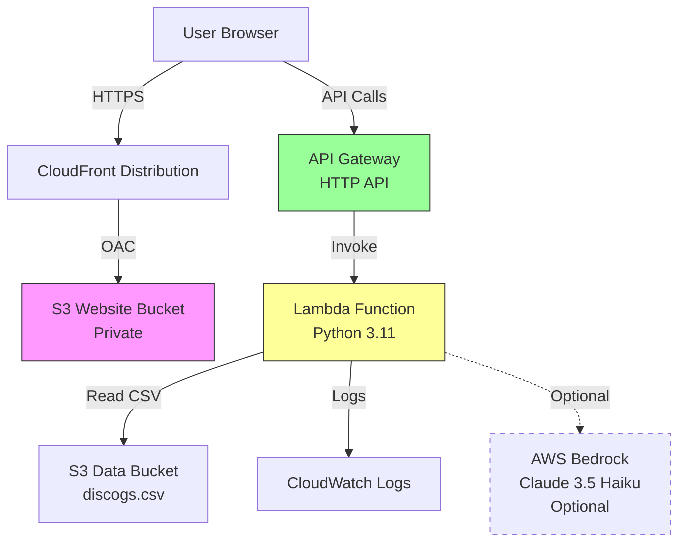
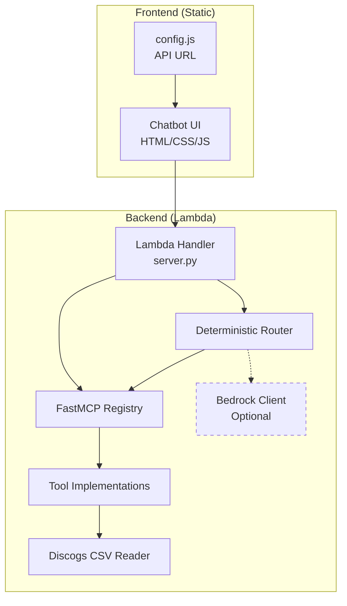
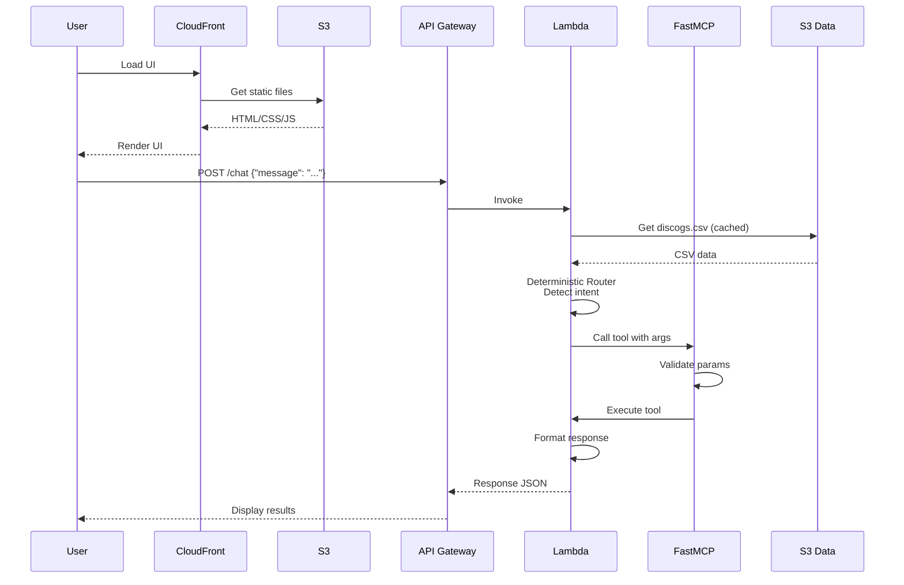
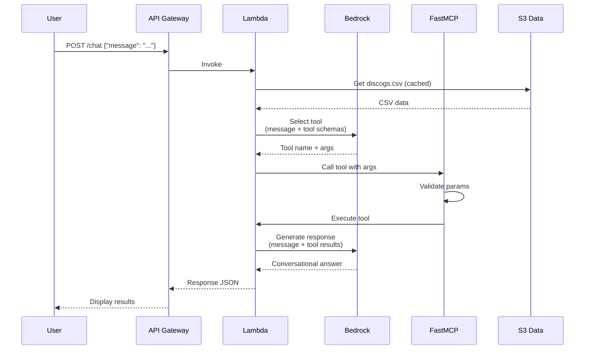
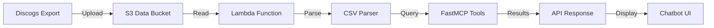
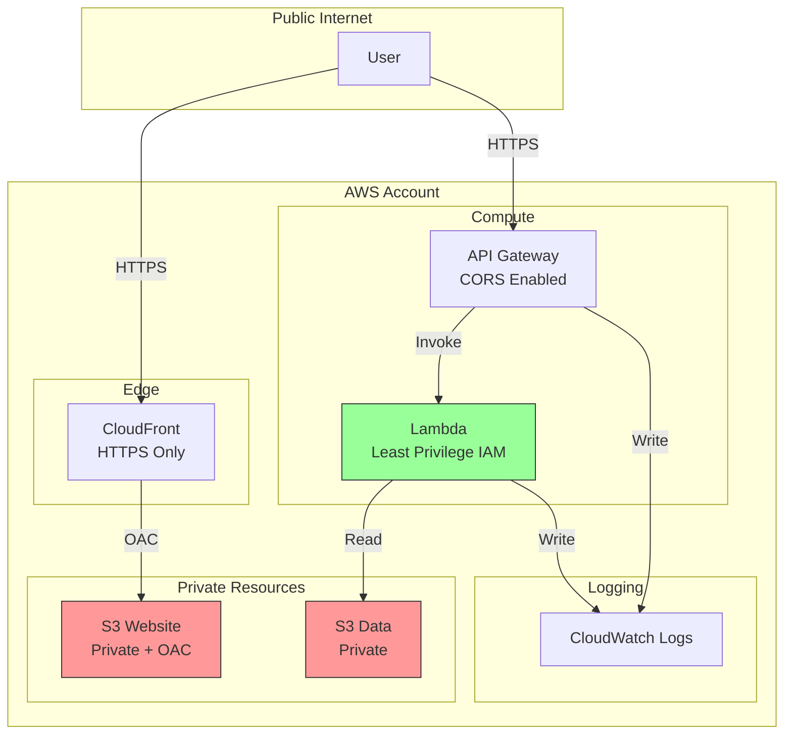
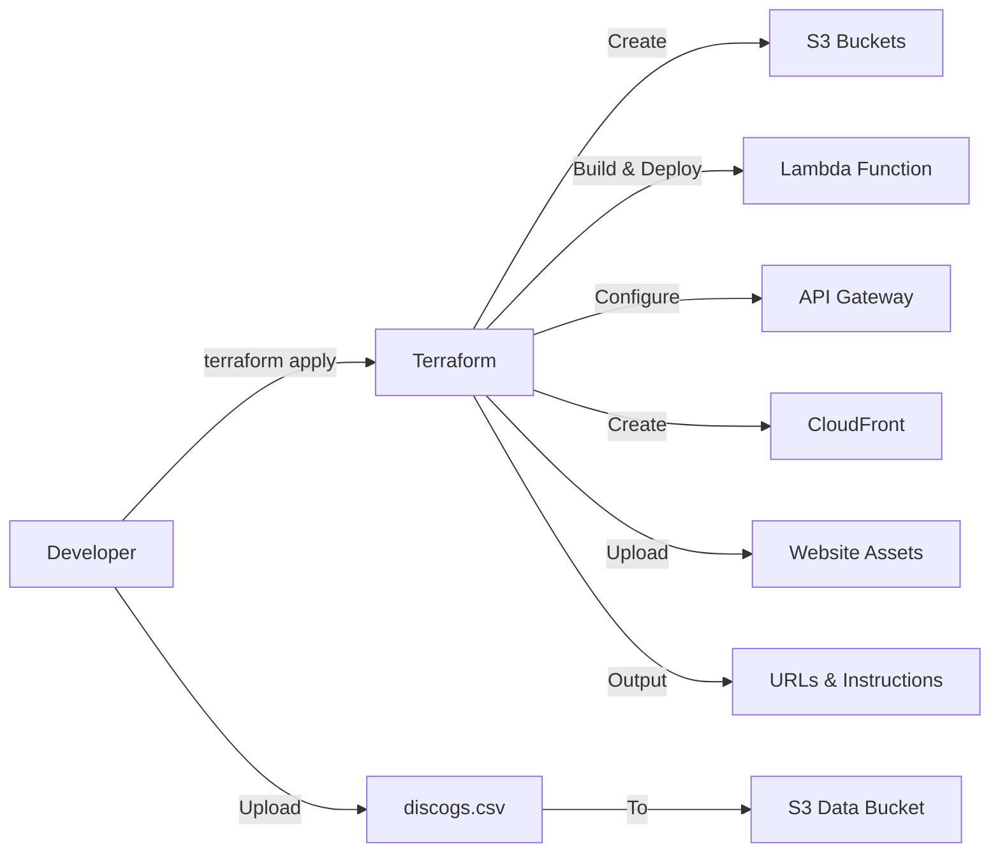

# Architecture Diagram

## High-Level Architecture

## Component Architecture

## Request Flow - Deterministic Mode

## Request Flow - Bedrock Mode (Optional)

## Data Flow

## Security Architecture

## Infrastructure Components

### Frontend Layer
- **CloudFront Distribution**: CDN for global low-latency access
- **S3 Website Bucket**: Private bucket with static assets (HTML, CSS, JS)
- **Origin Access Control (OAC)**: Secure access from CloudFront to S3

### API Layer
- **API Gateway (HTTP API)**: RESTful API with CORS support
  - POST /chat: Process chat messages
  - GET /tools: List available tools
  - GET /health: Health check
- **CloudWatch Logs**: Structured JSON access logs

### Compute Layer
- **Lambda Function**: Python 3.11 runtime
  - FastMCP tool registry
  - Deterministic router
  - Optional Bedrock integration
  - CSV processing
- **CloudWatch Logs**: Function execution logs

### Data Layer
- **S3 Data Bucket**: Stores discogs.csv
  - Private access
  - Versioning enabled
  - Lambda read permissions

### Security Layer
- **IAM Roles**: Least-privilege permissions
  - Lambda execution role
  - S3 read access (data bucket)
  - CloudWatch write access
  - Optional Bedrock invoke access
- **S3 Bucket Policies**: CloudFront OAC access
- **Public Access Block**: All S3 buckets private

## Deployment Flow

## Cost Optimization

- **CloudFront**: Caching reduces origin requests
- **Lambda**: Pay per invocation, 512MB memory
- **S3**: Minimal storage costs for static assets and CSV
- **API Gateway**: HTTP API (cheaper than REST API)
- **Bedrock**: Optional, pay per token when enabled

## Scalability

- **CloudFront**: Global edge locations, automatic scaling
- **API Gateway**: Handles 10,000 requests/second by default
- **Lambda**: Automatic scaling, 1000 concurrent executions default
- **S3**: Unlimited storage and requests

## Monitoring

- **CloudWatch Logs**: Lambda execution logs, API Gateway access logs
- **CloudWatch Metrics**: Lambda invocations, errors, duration
- **API Gateway Metrics**: Request count, latency, errors
- **CloudFront Metrics**: Cache hit ratio, requests

## Demo Features

1. **FastMCP Integration**: Tool definitions with automatic schema generation
2. **Deterministic Routing**: Works without LLM, cost-effective
3. **Optional Bedrock**: Enhanced conversational responses
4. **Production-Ready**: Proper IAM, logging, error handling
5. **Infrastructure-as-Code**: Complete Terraform deployment
6. **Serverless**: No servers to manage, automatic scaling
